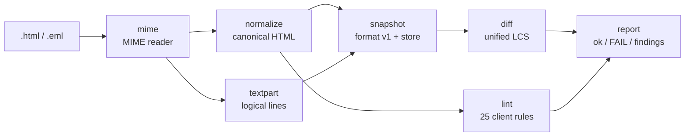

# mailgold

[English](README.md) | [中文](README.zh.md) | [日本語](README.ja.md)

[](LICENSE)  [](CHANGELOG.md)  [](CONTRIBUTING.md)

**mailgold：トランザクションメールのためのオープンソース・スナップショットテストツール — メールを理解した HTML 正規化、Outlook などクライアント固有の癖を突く lint、テキストパートの diff、すべてオフライン。**


```bash
git clone https://github.com/JaydenCJ/mailgold.git && cd mailgold && npm install && npm run build
```

> プレリリース：v0.1.0 はまだ npm に公開されていないため、上記の手順でソースからインストールしてください。ランタイム依存ゼロ — `npm install` が取得するのは TypeScript コンパイラだけです。

## なぜ mailgold？

パスワードリセット、領収書、確認リンクはプロダクトが送る最も重要度の高いメッセージなのに、たいてい最もテストされていません：テンプレートは Outlook デスクトップでは Word エンジンで描画され、Gmail では 102 KB を超えると切り詰められ、サポート窓口に問い合わせが届くまで誰も気づきません。汎用のスナップショットテストは役に立ちません — 送信のたびに新しい署名付き token が埋め込まれるため素朴なスナップショットは永遠に失敗し、バイト単位の HTML diff は何も変えない属性の並び替えで誤検知します。mailgold はメールの実際の挙動に合わせて正規化します：マークアップとインライン CSS を正準化し、送信ごとに変わる値（`token=`、`utm_*`、`cid:`）をパラメータ名の断言は残したまま消去し、`[if mso]` 条件付きコメントを保持し（メールでは本物のマークアップです）、`text/plain` パートを折り返しに影響されない形で HTML と並べて diff し、文書化された 25 のクライアント既知の癖を重大度・行番号・影響クライアント付きで lint します — CI に馴染む終了コードを持つ素の CLI として。

| | mailgold | 汎用スナップショット（Jest/Vitest） | Litmus / Email on Acid | html-validate |
| --- | --- | --- | --- | --- |
| 送信ごとの token・計測パラメータ | パターンで消去、設定はスナップショットに記録 | 毎回失敗、または自作シリアライザ | 対象外 — 目視レビュー | 対象外 |
| クライアントの癖の知識 | 25 ルール：Outlook Word エンジン、Gmail 切り詰め、Outlook.com の margin | なし | 実クライアントのスクリーンショットを人が確認 | 汎用 HTML/アクセシビリティ規則 |
| `text/plain` パート | 正規化して HTML と並べて diff | 無視 | 無視 | 範囲外 |
| 入力形式 | `.html` または完全な `.eml`（MIME、quoted-printable、base64） | レンダリング済み文字列 | 送信済みメール | HTML |
| オフライン / CI 実行 | 可 — 依存ゼロ・通信なし・終了コード | 可 | 不可 — クラウド課金 | 可 |
| 条件付きコメント `[if mso]` | マークアップとして保持 | ただのコメント扱い | そのまま描画 | 構文エラー扱い |

<sub>比較は 2026-07 時点の各上流ドキュメントに基づきます。スクリーンショットサービスが検証するのは描画の最終真実ですが、費用と 1 回数分の時間がかかります；mailgold はその手前で毎コミット走らせられる無料のサブ秒ゲートです。</sub>

## 機能

- **メールを理解した正規化** — タグ/属性を小文字化してソート、インライン `style` と `<style>` ブロックを正準化、実体参照の表記を統一（`&#160;` == `&nbsp;`）、空白を折り畳み：見た目だけ異なる 2 つのレンダリングがバイト単位で同一のスナップショットになります。
- **断言を保つ揮発値の消去** — `token=abc123` は `token=*` になり、購読解除リンクが token を運ぶことはスナップショットが証明し続けつつ、どの token かは固定しません；消去リストは設定可能でスナップショット自身に保存されます。
- **根拠つきのクライアント lint** — すべての検出がルール名・行番号・影響クライアント（`no-css-flexbox … [outlook, windows-mail]`）を示します；`error` は目に見える破壊、`warn` は静かな劣化を意味し、この重大度規律はレビューで強制されます。
- **テキストパートは一級市民** — `.eml` のスナップショットは `text/plain` も取り込み、論理行で比較します：折り返し直しでは決して落ちず、単語の変更では必ず落ちます；テキストパートの消失は合格ではなく失敗です。
- **本物の MIME リーダーを内蔵** — 折り返しヘッダ、入れ子 multipart、quoted-printable、base64、Latin-1、RFC 2047 件名；メーラーが実際に生成するバイト列をそのまま食わせられます。
- **レビューできるスナップショット、依存ゼロ** — スナップショットはバージョン付きヘッダを持つ行接頭辞テキストで、コミットして diff で読むために設計されています；ツール全体が Node 標準ライブラリのみ、完全オフラインで決定的です。

## クイックスタート

実際のメッセージのスナップショットを記録し、コミットごとにチェックします：

```bash
node dist/cli.js record examples/welcome.eml
node dist/cli.js check
```

実際にキャプチャした出力です。`welcome.eml` の各リンクには送信ごとに変わる `token=`/`sig=` が埋め込まれていますが、正規化時に `*` へ消去されるため、次の送信 — 新しい token、同じテンプレート — でも通ります：

```text
recorded welcome -> .mailgold/welcome.snap (html 57 lines, text 12 lines)
ok      welcome
1 snapshot: 1 ok
```

誰かが本当に文面を変更すると、`check` は終了コード 1 で失敗し、両パートの unified diff を出します：

```text
FAIL    welcome (html, text)
--- welcome (snapshot html)
+++ welcome (current html)
@@ -22,7 +22,7 @@
       </tr>
       <tr>
         <td style="color: #333333; font-family: Arial, sans-serif; font-size: 16px; padding: 0 24px 16px 24px">
-          Thanks for signing up — please confirm your email address within 24 hours.
+          Thanks for signing up — please confirm your email address within 48 hours.
         </td>
       </tr>
       <tr>
--- welcome (snapshot text)
+++ welcome (current text)
@@ -2,7 +2,7 @@
 
 Hi Dana,
 
-Thanks for signing up — please confirm your email address by opening the link below within 24 hours:
+Thanks for signing up — please confirm your email address by opening the link below within 48 hours:
 
 https://app.example.test/confirm?uid=*&token=*
 
1 snapshot: 0 ok, 1 failed
```

意図した変更なら `node dist/cli.js check --update` で承認し直せます。さらに、実際に配信するクライアントに向けて lint を：

```text
$ node dist/cli.js lint examples/newsletter.html --client outlook
examples/newsletter.html:6  error  no-external-stylesheet  <link rel="stylesheet"> is ignored by Gmail and Outlook; inline the CSS  [gmail, outlook]
examples/newsletter.html:8  warn   shorthand-hex-color  shorthand hex color #fff misrenders in older Outlook versions; write the six-digit form  [outlook]
examples/newsletter.html:9  error  no-css-flexbox  display: flex is ignored by Outlook (Word engine); build the layout with nested tables  [outlook, windows-mail]
...
5 errors, 12 warnings
```

## コマンドとオプション

| キー | 既定値 | 効果 |
| --- | --- | --- |
| `record <file...>` | — | `.html`/`.eml` を正規化して `--dir` に保存 |
| `check [name...]` | 全スナップショット | 各ソースを再正規化して diff；`--update` で承認し直し |
| `lint <file...>` | 全 25 ルール | クライアント互換ゲート；`--strict`、`--disable ids`、`--client list`、`--json` |
| `normalize <file>` | `--part html` | 正準形を表示（`.eml` には `--part text` も） |
| `--scrub list` | 内蔵の揮発パラメータ表 | どのクエリパラメータを `*` に消去するか |
| `--keep-query` | オフ | 消去を完全に無効化 |
| `--dir d` | `.mailgold` | スナップショット保存ディレクトリ |

終了コード：`0` 正常、`1` スナップショット不一致または lint エラー（`--strict` 時は警告も）、`2` 用法/入力エラー。根拠つきの完全なルール一覧は [docs/rules.md](docs/rules.md) にあり、`mailgold rules` でいつでも表示できます。

## 検証

このリポジトリは CI を一切同梱しません；上記の主張はすべてローカル実行で検証されます：`npm test`（93 の node:test テスト — パーサ、CSS、MIME、正規化器、消去器、differ、全 25 ルール、新規一時ディレクトリでの CLI 統合）に加えて `bash scripts/smoke.sh` が同梱の [examples](examples/README.md) をエンドツーエンドで通し、`SMOKE OK` を出力しなければなりません。

## アーキテクチャ



各ステージは文字列上の純関数です；ファイルシステムに触るのは CLI とスナップショットストアだけなので、パイプライン全体をライブラリとして import できます（`import { normalizeHtml, lintHtml, parseEml } from "mailgold"`）。

## ロードマップ

- [x] v0.1.0 — メールを理解した正規化、揮発値消去、`.eml` MIME リーダー、折り返し非依存のテキストパート diff、25 ルールのクライアント lint、record/check/update CLI、依存ゼロ、93 テスト + smoke スクリプト
- [ ] リンク整合ルール：HTML パートの全 URL がテキストパートにも存在すること
- [ ] スナップショット diff の行内単語ハイライト
- [ ] AMP for Email：`text/x-amp-html` パートがあればスナップショットに含める
- [ ] クライアントプロファイル（`--profile outlook-2019`）で世代ごとにルールセットを固定
- [ ] `check --json` の機械可読レポートで CI アノテーション

全リストは [open issues](https://github.com/JaydenCJ/mailgold/issues) を参照してください。

## コントリビュート

バグ報告、（文書の根拠つきの）新しい癖ルール、pull request を歓迎します — ローカルの作業手順は [CONTRIBUTING.md](CONTRIBUTING.md) を参照（`npm test` と、`SMOKE OK` を出力する `scripts/smoke.sh`）。入門しやすい課題には [good first issue](https://github.com/JaydenCJ/mailgold/issues?q=is%3Aissue+is%3Aopen+label%3A%22good+first+issue%22) のラベルがあり、設計の議論は [Discussions](https://github.com/JaydenCJ/mailgold/discussions) で行っています。

## ライセンス

[MIT](LICENSE)
