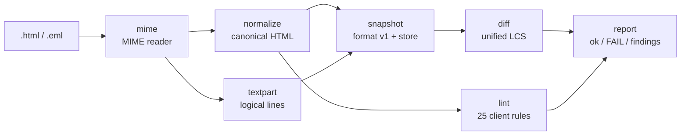

# mailgold

[English](README.md) | [中文](README.zh.md) | [日本語](README.ja.md)

[](LICENSE)  [](CHANGELOG.md)  [](CONTRIBUTING.md)

**mailgold：an open-source snapshot-testing tool for transactional email — email-aware HTML normalization, client-quirk lint for Outlook and friends, and a text-part diff, all offline.**


```bash
git clone https://github.com/JaydenCJ/mailgold.git && cd mailgold && npm install && npm run build
```

> Pre-release: v0.1.0 is not yet published to npm; install from source as above. Zero runtime dependencies — `npm install` fetches only the TypeScript compiler.

## Why mailgold?

Password resets, receipts and confirmation links are the highest-stakes messages a product sends, and they are usually the least tested: templates render through the Word engine in Outlook desktop, get clipped at 102 KB by Gmail, and nobody notices until support tickets arrive. Generic snapshot testing does not help — every send embeds a fresh signed token, so naive snapshots fail forever, and byte-level HTML diffs fire on attribute reordering that changes nothing. mailgold normalizes the way email actually works: it canonicalizes markup and inline CSS, scrubs per-send volatility (`token=`, `utm_*`, `cid:`) while keeping the parameter names asserted, keeps `[if mso]` conditional comments because in email they are real markup, diffs the `text/plain` part wrap-insensitively alongside the HTML, and lints 25 documented client quirks with severity, source line and the affected client — as a plain CLI with CI-friendly exit codes.

| | mailgold | generic snapshots (Jest/Vitest) | Litmus / Email on Acid | html-validate |
| --- | --- | --- | --- | --- |
| Per-send tokens & tracking params | scrubbed by pattern, config recorded in the snapshot | fail every run, or DIY serializers | n/a — visual review | n/a |
| Client-quirk knowledge | 25 rules: Outlook Word engine, Gmail clipping, Outlook.com margins | none | real client screenshots, reviewed by humans | generic HTML/a11y rules |
| `text/plain` part | normalized and diffed alongside the HTML | ignored | ignored | out of scope |
| Input formats | `.html` or full `.eml` (MIME, quoted-printable, base64) | rendered strings | a sent email | HTML |
| Offline / in CI | yes — zero deps, no network, exit codes | yes | no — cloud subscription | yes |
| Conditional comments `[if mso]` | preserved as markup | treated as comments | rendered | flagged as syntax |

<sub>Comparison reflects upstream documentation as of 2026-07. Screenshot services test rendering truth but cost money and minutes per run; mailgold is the free, sub-second gate you run on every commit before them.</sub>

## Features

- **Email-aware normalization** — tags/attributes lowercased and sorted, inline `style` and `<style>` blocks canonicalized, entity spellings unified (`&#160;` == `&nbsp;`), whitespace collapsed: two renders that differ only cosmetically produce byte-identical snapshots.
- **Volatility scrubbing that keeps the assertion** — `token=abc123` becomes `token=*`, so the snapshot still proves the unsubscribe link carries a token without pinning which one; the scrub list is configurable and stored in the snapshot itself.
- **Client-quirk lint with receipts** — every finding names the rule, the source line and the affected clients (`no-css-flexbox … [outlook, windows-mail]`); `error` means visibly broken, `warn` means silently degraded, and the severity discipline is enforced in review.
- **The text part is a first-class citizen** — `.eml` snapshots capture `text/plain` too, compared as logical lines so re-wrapping never fails a check but a changed word always does; a dropped text part is a failure, not a pass.
- **A real MIME reader built in** — folded headers, nested multiparts, quoted-printable, base64, Latin-1 and RFC 2047 subjects; point mailgold at the actual bytes your mailer produces.
- **Reviewable snapshots, zero dependencies** — snapshots are line-prefixed text files with a versioned header, made to be committed and read in diffs; the whole tool is Node stdlib only, fully offline, deterministic.

## Quickstart

Record a snapshot of a real message, then check it on every commit:

```bash
node dist/cli.js record examples/welcome.eml
node dist/cli.js check
```

Real captured output. Every link in `welcome.eml` embeds per-send `token=`/`sig=` values; they are scrubbed to `*` at normalization time, so the next send — new token, same template — still passes:

```text
recorded welcome -> .mailgold/welcome.snap (html 57 lines, text 12 lines)
ok      welcome
1 snapshot: 1 ok
```

When someone edits the copy for real, `check` exits 1 with a unified diff of both parts:

```text
FAIL    welcome (html, text)
--- welcome (snapshot html)
+++ welcome (current html)
@@ -22,7 +22,7 @@
       </tr>
       <tr>
         <td style="color: #333333; font-family: Arial, sans-serif; font-size: 16px; padding: 0 24px 16px 24px">
-          Thanks for signing up — please confirm your email address within 24 hours.
+          Thanks for signing up — please confirm your email address within 48 hours.
         </td>
       </tr>
       <tr>
--- welcome (snapshot text)
+++ welcome (current text)
@@ -2,7 +2,7 @@
 
 Hi Dana,
 
-Thanks for signing up — please confirm your email address by opening the link below within 24 hours:
+Thanks for signing up — please confirm your email address by opening the link below within 48 hours:
 
 https://app.example.test/confirm?uid=*&token=*
 
1 snapshot: 0 ok, 1 failed
```

Intended change? `node dist/cli.js check --update` re-blesses it. And lint the template against the clients you actually send to:

```text
$ node dist/cli.js lint examples/newsletter.html --client outlook
examples/newsletter.html:6  error  no-external-stylesheet  <link rel="stylesheet"> is ignored by Gmail and Outlook; inline the CSS  [gmail, outlook]
examples/newsletter.html:8  warn   shorthand-hex-color  shorthand hex color #fff misrenders in older Outlook versions; write the six-digit form  [outlook]
examples/newsletter.html:9  error  no-css-flexbox  display: flex is ignored by Outlook (Word engine); build the layout with nested tables  [outlook, windows-mail]
...
5 errors, 12 warnings
```

## Commands and options

| Key | Default | Effect |
| --- | --- | --- |
| `record <file...>` | — | normalize a `.html`/`.eml` and store it under `--dir` |
| `check [name...]` | all snapshots | re-normalize each source and diff; `--update` re-blesses |
| `lint <file...>` | all 25 rules | client-quirk gate; `--strict`, `--disable ids`, `--client list`, `--json` |
| `normalize <file>` | `--part html` | print the canonical form (also `--part text` for `.eml`) |
| `--scrub list` | built-in volatile params | which query parameters to scrub to `*` |
| `--keep-query` | off | disable scrubbing entirely |
| `--dir d` | `.mailgold` | snapshot store directory |

Exit codes: `0` ok, `1` snapshot mismatch or lint errors (warnings too with `--strict`), `2` usage/input error. The full rule catalog with rationale lives in [docs/rules.md](docs/rules.md); print it anytime with `mailgold rules`.

## Verification

This repository ships no CI; every claim above is verified by local runs: `npm test` (93 node:test tests — parser, CSS, MIME, normalizer, scrubber, differ, all 25 rules, CLI integration in fresh temp dirs) plus `bash scripts/smoke.sh`, an end-to-end pass over the bundled [examples](examples/README.md) that must print `SMOKE OK`.

## Architecture



Every stage is a pure function over strings; only the CLI and the snapshot store touch the filesystem, so the whole pipeline is importable as a library (`import { normalizeHtml, lintHtml, parseEml } from "mailgold"`).

## Roadmap

- [x] v0.1.0 — email-aware normalization, volatility scrubbing, `.eml` MIME reader, wrap-insensitive text-part diff, 25-rule client lint, record/check/update CLI, zero dependencies, 93 tests + smoke script
- [ ] link parity rule: every URL in the HTML part must appear in the text part
- [ ] intra-line word highlighting in snapshot diffs
- [ ] AMP for Email: snapshot the `text/x-amp-html` part when present
- [ ] client profiles (`--profile outlook-2019`) pinning rule sets per client generation
- [ ] `check --json` machine-readable report for CI annotation

See the [open issues](https://github.com/JaydenCJ/mailgold/issues) for the full list.

## Contributing

Bug reports, new quirk rules (with documentation receipts) and pull requests are welcome — see [CONTRIBUTING.md](CONTRIBUTING.md) for the local workflow (`npm test` plus `scripts/smoke.sh` printing `SMOKE OK`). Good entry points are labelled [good first issue](https://github.com/JaydenCJ/mailgold/issues?q=is%3Aissue+is%3Aopen+label%3A%22good+first+issue%22), and design questions live in [Discussions](https://github.com/JaydenCJ/mailgold/discussions).

## License

[MIT](LICENSE)
