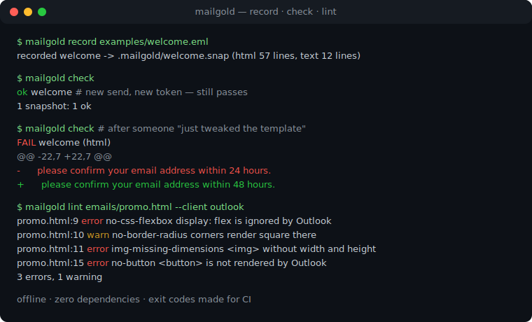
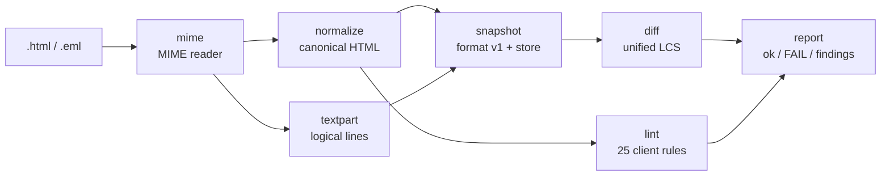

# mailgold

[English](README.md) | [中文](README.zh.md) | [日本語](README.ja.md)

[](LICENSE)  [](CHANGELOG.md)  [](CONTRIBUTING.md)

**mailgold：面向事务性邮件的开源快照测试工具 —— 懂邮件的 HTML 归一化、针对 Outlook 等客户端的兼容性 lint、纯文本部分的 diff，全程离线。**



```bash
git clone https://github.com/JaydenCJ/mailgold.git && cd mailgold && npm install && npm run build
```

> 预发布：v0.1.0 尚未发布到 npm，请按上述方式从源码安装。零运行时依赖 —— `npm install` 只会拉取 TypeScript 编译器。

## 为什么选 mailgold？

密码重置、收据和确认链接是产品发出的风险最高的消息，却往往测试得最少：模板在 Outlook 桌面版里由 Word 引擎渲染，在 Gmail 里超过 102 KB 就被截断，而没人察觉，直到工单涌来。通用快照测试帮不上忙 —— 每次发送都嵌入新的签名 token，朴素的快照会永远失败；字节级 HTML diff 又会在毫无意义的属性重排上误报。mailgold 按邮件真实的工作方式做归一化：规范化标记和内联 CSS，擦除每次发送的易变值（`token=`、`utm_*`、`cid:`）同时保留被断言的参数名，保留 `[if mso]` 条件注释（在邮件里它们是货真价实的标记），把 `text/plain` 部分以换行不敏感的方式与 HTML 一起 diff，并以 25 条有据可查的客户端怪癖规则做 lint，逐条给出严重级别、源码行号和受影响的客户端 —— 一个纯 CLI，退出码天生适合 CI。

| | mailgold | 通用快照（Jest/Vitest） | Litmus / Email on Acid | html-validate |
| --- | --- | --- | --- | --- |
| 每次发送的 token 与跟踪参数 | 按模式擦除，配置记录在快照内 | 每次运行都失败，或自写序列化器 | 不适用 —— 人工目检 | 不适用 |
| 客户端怪癖知识 | 25 条规则：Outlook Word 引擎、Gmail 截断、Outlook.com margin | 无 | 真实客户端截图，人工审阅 | 通用 HTML/无障碍规则 |
| `text/plain` 部分 | 归一化后与 HTML 一起 diff | 忽略 | 忽略 | 超出范围 |
| 输入格式 | `.html` 或完整 `.eml`（MIME、quoted-printable、base64） | 渲染后的字符串 | 已发送的邮件 | HTML |
| 离线 / CI 内运行 | 是 —— 零依赖、无网络、有退出码 | 是 | 否 —— 云端订阅 | 是 |
| 条件注释 `[if mso]` | 作为标记保留 | 当普通注释处理 | 直接渲染 | 报为语法问题 |

<sub>对比基于 2026-07 各家上游文档。截图服务测的是渲染的最终真相，但花钱且每轮要几分钟；mailgold 是在它们之前、每次提交都能跑的免费亚秒级门禁。</sub>

## 功能

- **懂邮件的归一化** —— 标签/属性统一小写并排序，内联 `style` 与 `<style>` 块规范化，实体写法统一（`&#160;` == `&nbsp;`），空白折叠：两次仅有外观差异的渲染产生逐字节相同的快照。
- **保留断言的易变值擦除** —— `token=abc123` 变为 `token=*`，快照仍能证明退订链接带有 token，却不锁定具体是哪个；擦除清单可配置并存进快照本身。
- **有出处的客户端怪癖 lint** —— 每条发现都给出规则名、源码行号和受影响客户端（`no-css-flexbox … [outlook, windows-mail]`）；`error` 表示可见的破坏，`warn` 表示静默降级，严重级别纪律在评审中被强制执行。
- **纯文本部分是一等公民** —— `.eml` 快照同样捕获 `text/plain`，按逻辑行比较：重新换行永远不会挂掉检查，改动一个词则必然挂掉；文本部分被弄丢算失败，不算通过。
- **内置真正的 MIME 读取器** —— 折叠头、嵌套 multipart、quoted-printable、base64、Latin-1 和 RFC 2047 主题；把 mailgold 指向你的发信程序真实产出的字节即可。
- **可评审的快照，零依赖** —— 快照是带版本头的行前缀文本文件，天生适合提交和在 diff 里阅读；整个工具只用 Node 标准库，完全离线、完全确定。

## 快速上手

给真实消息录制一份快照，然后在每次提交时检查：

```bash
node dist/cli.js record examples/welcome.eml
node dist/cli.js check
```

真实捕获的输出。`welcome.eml` 里每个链接都嵌着随发送变化的 `token=`/`sig=` 值；归一化时它们被擦成 `*`，所以下一次发送 —— 新 token、同一模板 —— 依然通过：

```text
recorded welcome -> .mailgold/welcome.snap (html 57 lines, text 12 lines)
ok      welcome
1 snapshot: 1 ok
```

当有人真的改了文案，`check` 以退出码 1 失败，并给出两个部分的统一 diff：

```text
FAIL    welcome (html, text)
--- welcome (snapshot html)
+++ welcome (current html)
@@ -22,7 +22,7 @@
       </tr>
       <tr>
         <td style="color: #333333; font-family: Arial, sans-serif; font-size: 16px; padding: 0 24px 16px 24px">
-          Thanks for signing up — please confirm your email address within 24 hours.
+          Thanks for signing up — please confirm your email address within 48 hours.
         </td>
       </tr>
       <tr>
--- welcome (snapshot text)
+++ welcome (current text)
@@ -2,7 +2,7 @@
 
 Hi Dana,
 
-Thanks for signing up — please confirm your email address by opening the link below within 24 hours:
+Thanks for signing up — please confirm your email address by opening the link below within 48 hours:
 
 https://app.example.test/confirm?uid=*&token=*
 
1 snapshot: 0 ok, 1 failed
```

是有意的改动？用 `node dist/cli.js check --update` 重新祝福即可。再针对你真正投递的客户端做 lint：

```text
$ node dist/cli.js lint examples/newsletter.html --client outlook
examples/newsletter.html:6  error  no-external-stylesheet  <link rel="stylesheet"> is ignored by Gmail and Outlook; inline the CSS  [gmail, outlook]
examples/newsletter.html:8  warn   shorthand-hex-color  shorthand hex color #fff misrenders in older Outlook versions; write the six-digit form  [outlook]
examples/newsletter.html:9  error  no-css-flexbox  display: flex is ignored by Outlook (Word engine); build the layout with nested tables  [outlook, windows-mail]
...
5 errors, 12 warnings
```

## 命令与选项

| 键 | 默认值 | 效果 |
| --- | --- | --- |
| `record <file...>` | — | 归一化 `.html`/`.eml` 并存入 `--dir` |
| `check [name...]` | 全部快照 | 重新归一化各来源并 diff；`--update` 重新祝福 |
| `lint <file...>` | 全部 25 条规则 | 客户端怪癖门禁；`--strict`、`--disable ids`、`--client list`、`--json` |
| `normalize <file>` | `--part html` | 打印规范形式（对 `.eml` 还可 `--part text`） |
| `--scrub list` | 内置易变参数表 | 哪些查询参数被擦成 `*` |
| `--keep-query` | 关 | 完全禁用擦除 |
| `--dir d` | `.mailgold` | 快照存储目录 |

退出码：`0` 正常，`1` 快照不匹配或 lint 错误（加 `--strict` 时警告同样算），`2` 用法/输入错误。完整规则目录及依据见 [docs/rules.md](docs/rules.md)；随时可用 `mailgold rules` 打印。

## 验证

本仓库不带任何 CI；上述每一条主张都由本地运行验证：`npm test`（93 个 node:test 测试 —— 解析器、CSS、MIME、归一化器、擦除器、differ、全部 25 条规则、在全新临时目录里的 CLI 集成）加 `bash scripts/smoke.sh`，对捆绑的 [examples](examples/README.md) 做端到端检验，必须打印 `SMOKE OK`。

## 架构



每个阶段都是字符串上的纯函数；只有 CLI 和快照存储会碰文件系统，因此整条流水线可以当库引用（`import { normalizeHtml, lintHtml, parseEml } from "mailgold"`）。

## 路线图

- [x] v0.1.0 —— 懂邮件的归一化、易变值擦除、`.eml` MIME 读取器、换行不敏感的文本部分 diff、25 条规则的客户端 lint、record/check/update CLI、零依赖、93 个测试 + smoke 脚本
- [ ] 链接一致性规则：HTML 部分的每个 URL 都必须出现在文本部分
- [ ] 快照 diff 的行内单词高亮
- [ ] AMP for Email：存在 `text/x-amp-html` 部分时一并快照
- [ ] 客户端配置档（`--profile outlook-2019`），按客户端世代锁定规则集
- [ ] `check --json` 机器可读报告，便于 CI 注解

完整列表见 [open issues](https://github.com/JaydenCJ/mailgold/issues)。

## 贡献

欢迎 bug 报告、新的怪癖规则（附文档出处）和 pull request —— 本地工作流见 [CONTRIBUTING.md](CONTRIBUTING.md)（`npm test` 加上打印 `SMOKE OK` 的 `scripts/smoke.sh`）。入门任务标注为 [good first issue](https://github.com/JaydenCJ/mailgold/issues?q=is%3Aissue+is%3Aopen+label%3A%22good+first+issue%22)，设计讨论在 [Discussions](https://github.com/JaydenCJ/mailgold/discussions)。

## 许可证

[MIT](LICENSE)
